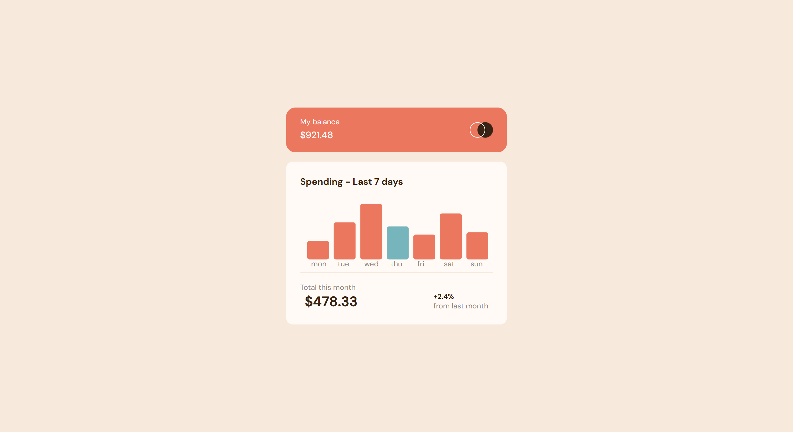

# Frontend Mentor - Expenses chart component solution

This is a solution to the [Expenses chart component challenge on Frontend Mentor](https://www.frontendmentor.io/challenges/expenses-chart-component-e7yJBUdjwt). Frontend Mentor challenges help you improve your coding skills by building realistic projects. 

## Overview

### The challenge

Users should be able to:

- View the bar chart and hover over the individual bars to see the correct amounts for each day
- See the current day’s bar highlighted in a different colour to the other bars
- View the optimal layout for the content depending on their device’s screen size
- See hover states for all interactive elements on the page
- **Bonus**: Use the JSON data file provided to dynamically size the bars on the chart

### Screenshot



### Links

- Solution URL: [Solution](https://github.com/aisyahhannes/expenses-chart-frontend-mentor)
- Live Site URL: [Live site](https://aisyahhannes.github.io/expenses-chart-frontend-mentor)

## My process

### What I Learned

```js
// Fetching JSON data using fetch()
fetch('data.json')
    .then(response => response.json())
    .then(data => console.log(data))
    .catch(error => console.error("Error fetching JSON:", error));

// Creating bar chart using D3.js
var svg = d3.select('svg')
    .attr("width", 400)
    .attr("height", 150);

fetch('data.json')
    .then(response => response.json())
    .then(data => {
        var bars = svg.selectAll("rect")
            .data(data)
            .enter()
            .append("rect")
            .attr("x", (d, i) => i * 50)
            .attr("y", d => 150 - d.amount)
            .attr("height", d => d.amount)
            .attr("width", 40)
            .attr("fill", "#ec775f");
    })
    .catch(error => console.error("Error loading data:", error));

// Converting getDay() numeric output into a day name 
const today = new Date();
const days = ["Sun", "Mon", "Tue", "Wed", "Thu", "Fri", "Sat"];
var currentDay = days[today.getDay()];
console.log("Today is:", currentDay);

// Retrieving an HTML element's width and height using clientWidth and clientHeight
var svg = document.querySelector("svg");
console.log("SVG Width:", svg.clientWidth, "SVG Height:", svg.clientHeight);

// Automatically reloading the page on resize for responsiveness
window.onresize = () => { 
    window.location.reload();
};

// Using getBoundingClientRect() to get an element's position and size
var rect = svg.getBoundingClientRect();
console.log("SVG position:", rect);
```

### Useful resources

- [Scrimba d3.js](https://v1.scrimba.com/learn/d3js\) - Making bar chart with D3.js
- [Medium](https://dizzpy.medium.com/how-to-connect-html-with-json-using-javascript-a-beginners-guide-25e94306fa0f) - Connecting JSON with HTML using JavaScript